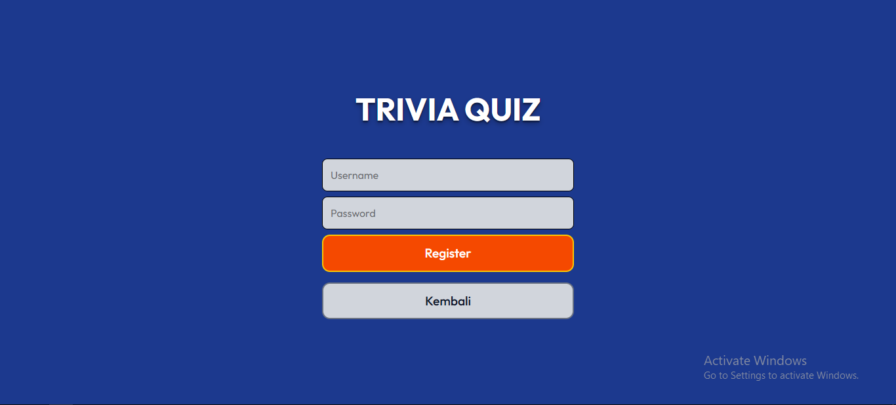
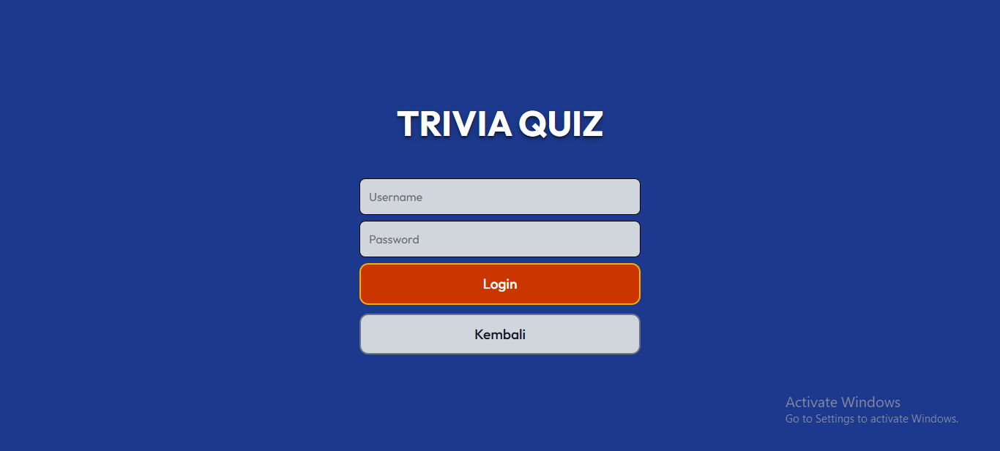
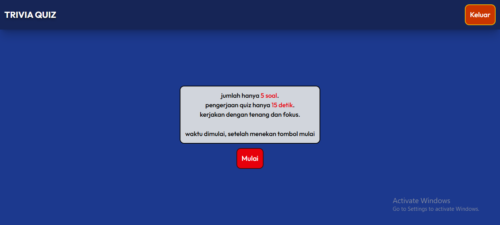
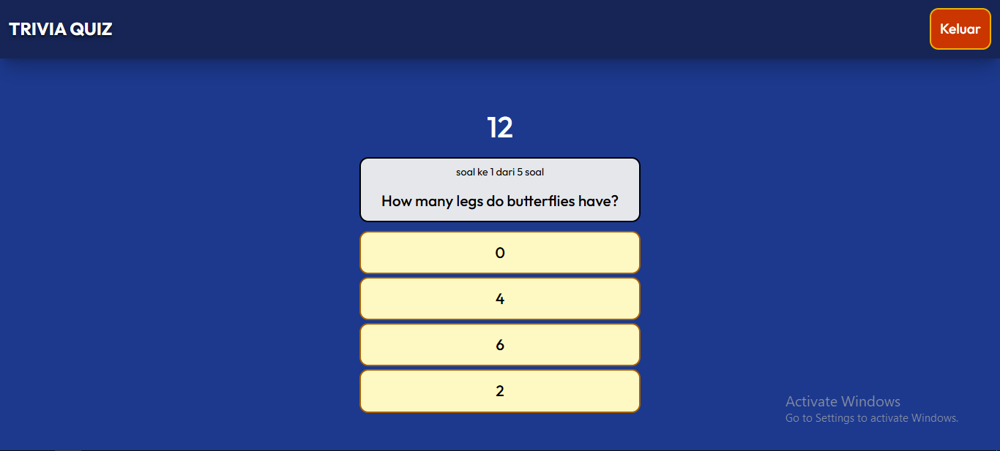

## 📃Tentang Trivia Quiz Web

Trivia Quiz adalah sebuah game sederhana berupa quiz berbasis web yang dibuat dengan menggunakan React. Data pertanyaan quiz, diambil menggunakan API dari sebuah web (https://opentdb.com/). Aplikasi ini berjalan hanya disisi client sehingga proses penyimpanan data user menggunakan local storage bawaan browser.

Demo: https://trivia-quiz-fan.netlify.app/

## ✨Fitur

- Memiliki fitur auth berupa login/logout dan register.
- Terdapat timer saat quiz dimulai.
- Soal pada quiz ditutup ketika timer habis dan langsung menampilkan hasil perolehan.
- Menampilkan hanya 1 soal pada halaman dan akan berganti ketika setelah memilih jawaban.

## 📷Screenshots
**Landing Page**


**Register**


**Login**


**Pretest**


**Test**


**Result**


## 💻Tech Stack

**Frontend**
- JavaScript (ES6+)
- React
- HTML5 & CSS3
- Tailwind
**Tools**
- Vite

## 📚Struktur Project
```
├── public/  
│ ├── _redirects/  
├── src/  
│ ├── components/  
│ ├── pages/  
│ ├── routes/  
│ └── layouts/  
├── main.jsx  
└── index.css
```

## ⚙Installasi & Setup

Prasyarat:
install node.js (https://nodejs.org/)

Setelah melakukan prasyarat,

Ikuti langkah berikut:
```
# Clone repository
git clone https://github.com/irfanur02/trivia-quiz.git

# Masuk ke folder project
cd trivia-quiz

# Install dependencies
npm install

# Jalankan development server
npm run dev
```
Lalu, akses aplikasi melalui browser:
```
http://localhost:5173
```

## 🎯Tujuan
Proyek ini dibuat sebagai prasyarat pendaftaran mengikuti Frontend Engineering Internship Program yang diselenggarakan oleh DOT Indonesia.
